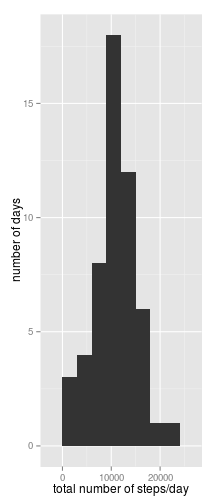
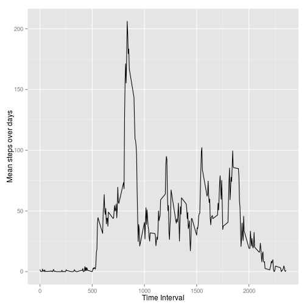
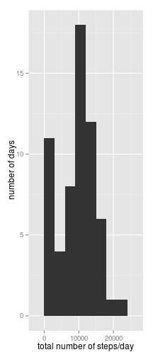
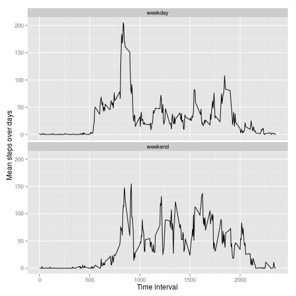

Reproducible Research: Peer Assessment 1
==================================================
First load the libraries we need...  


```r
Sys.setlocale('LC_TIME','C')##have to do this beacuse my computer speaks German to me
```

```
## [1] "C"
```

```r
library(ggplot2)
library(plyr)
```

## Loading and preprocessing the data
Then load the data, and have a look    


```r
data<-read.csv('activity.csv', header =T, 
               colClasses = c('integer', 'Date', 'integer'))
head(data)
```

```
##   steps       date interval
## 1    NA 2012-10-01        0
## 2    NA 2012-10-01        5
## 3    NA 2012-10-01       10
## 4    NA 2012-10-01       15
## 5    NA 2012-10-01       20
## 6    NA 2012-10-01       25
```

## What is mean total number of steps taken per day?
First calculate the total steps per day, and then plot a histogram of the data
(I played around with the binwidth and liked 3000).  


```r
steps.day.total<-aggregate(steps~date, data = data, FUN = sum,na.rm = T)
qplot(steps.day.total$steps, binwidth = 3000, ylab = 'number of days', 
      xlab = 'total number of steps/day')
```

 

```r
##calculate mean and median
steps.daily.avg<-c(Mean = mean(steps.day.total$steps, na.rm =T),
                   Median = median(steps.day.total$steps, na.rm =T))
##report mean and median
steps.daily.avg
```

```
##   Mean Median 
##  10766  10765
```
Okay so mean and median total steps per day are fairly equal.  

## What is the average daily activity pattern?

Calculate summary statistics for each interval,  
then plot the timeseries and find the interval with the mean maximum number of steps.  


```r
avg.steps.interval<-aggregate(steps~interval, data = data, FUN = mean, na.rm =T)

qplot(x = interval, y = steps,data = avg.steps.interval, geom = 'line',
      xlab = 'Time Interval', ylab = 'Mean steps over days')
```

 

```r
avg.steps.interval[which.max(avg.steps.interval$step),]
```

```
##     interval steps
## 104      835 206.2
```

So the interval is a mixture of minutes and hours; I decided to stick to the 
original interval specification (b/c the plot within the assignment did as well.
One could have transformed the interval variable to minutes or hours, e.g. using
the *lubridate* package).  

The maximum value of 206 steps occured at the 835 interval (which would 
translate to *8:35 am* : maybe the subject decided to take the stairs when going
into the office. 
  
## Imputing missing values
* Calculate and report the number of missing values
* Devise a strategy for filling in all of the missing
  values in the dataset.
* Create a new dataset that is equal to the original dataset but with the 
missing data filled in
*What kind of effect does imputation of missing values cause ?

```r
sum(is.na(data$steps)) ## calculate missing data
```

```
## [1] 2304
```

```r
##calculate median interval data for imputation
median.steps.interval<-aggregate(steps~interval, data = data, FUN = median)
data2<-data ##copy original data
data2$steps[is.na(data2$steps)] <- 
median.steps.interval$steps[match(data2$interval[is.na(data2$steps)],
                                   median.steps.interval$interval)]##replace NAs in the new dataset
sum(is.na(data2$steps)) ##check for NAs
```

```
## [1] 0
```

```r
##
steps.day.total2<-aggregate(steps~date, data = data2, FUN = sum,na.rm = T)
qplot(steps.day.total2$steps, binwidth = 3000, ylab = 'number of days', 
      xlab = 'total number of steps/day')
```

 

```r
steps.daily.avg2<-c(mean = mean(steps.day.total2$steps, na.rm =T),
                   median = median(steps.day.total2$steps, na.rm =T))

steps.daily.avg-steps.daily.avg2##report differences in mean and median between original and imputated dataset
```

```
##   Mean Median 
##   1262    370
```

```r
#What is the impact of imputing missing data on the estimates of the total daily number of steps?

round((steps.daily.avg-steps.daily.avg2)/steps.daily.avg*100) ##calculate percentage change from orignal data
```

```
##   Mean Median 
##     12      3
```
Imputing the missing values with the median for the dataset interval resulted in
slight changes to mean and median values of the total steps per day. One can see
that these differences affected especially the first bin (compare histograms of)
original and imputed dataset).At this point I would probably try a different 
method an re-check the results then...[I don't do here though].

## Are there differences in activity patterns between weekdays and weekends?

```r
##make a factor variable
data2$week<-ifelse(weekdays(data$date)%in% c("Sunday", "Saturday"),
                   'weekend', 'weekday')
data2$week<-as.factor(data2$week)
##summarize the data by interval and week-factor
steps.week<-ddply(data2, .(interval, week),summarise, mean = mean(steps))
##create a plot
gg<-ggplot(steps.week, aes(x = interval, y = mean))
gg+geom_line()+facet_wrap(~ week, ncol = 1)+
        xlab('Time interval')+ ylab('Mean steps over days')
```

 

Comparing the two plots, there seems to be more step-activity after 10 am at the 
weekend. This could be analyzed by plotting the difference for the averaged 
intervals between weekday and weekend.
